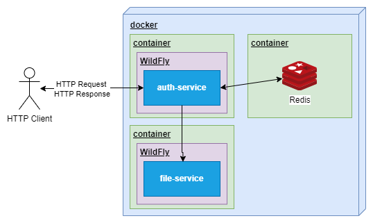

:toc: left
:toclevels: 4
:sectnums:
:sectnumlevels: 4
:source-highlighter: rouge
:rouge-style: thankful_eyes
:icons: font

= Auth module

The auth module application based on Jakarta and Wildfly technology, wich can be
integrated into applications capable of HTTP-based communication.

The aim of the project is to develop an authentication and authorization
solution that can be easily integrated into other applications.

== Architecture

The main usage model for how the auth-service should be used
is illustrated in the following diagram:

== Configuration

To configure the application, you can use a .properties file or environment variables.

Some important settings:

[cols="^,^,^,^"]
|===
| ENV | Properties key | Sample value | Description

| COFFEE_REDIS_AUTH_HOST | coffee.redis.auth.host | evocelot-auth-redis | The redis host. Can be the docker name too.
| COFFEE_REDIS_AUTH_PORT | coffee.redis.auth.port | 6379 | The redis port.
| TOKEN_ACCESS_MAX_TTL | token.access.max-ttl | 10 | The time to live property of the access token in minute.
| TOKEN_REFRESH_MAX_TTL | token.refresh.max-ttl | 10080 | The time to live property of the refresh token in minute.
| FILESERVICE_MP_REST_URL | fileService/mp-rest/url | http://evocelot-file-service:8080 | The url of the file service. Only when you want to manage the profile pictures.
|===

== Endpoints

=== POST /auth-service/auth/get-new-access-token/{token-value}

*Summary:* Get new access token

*Description:* Endpoint for obtaining a new access token. This endpoint invalidates the original access token.

*Parameters:*
- __token-value__: The value of the refresh token. (in path, required, string)

*Security:*
- AccessToken: []

=== POST /auth-service/auth/login

*Summary:* Login

*Description:* Endpoint for logging in. This endpoint provides the user with access and refresh tokens.

*Security:*
- AccessToken: []

=== POST /auth-service/auth/logout

*Summary:* Logout

*Description:* Endpoint for logging out. This endpoint invalidates the current access  and the refresh token.

*Security:*
- AccessToken: []

=== PUT /auth-service/partner/current

*Summary:* Update current partner

*Description:* Endpoint for updating the current (logged) partner.

*Security:*
- AccessToken: []

=== PUT /auth-service/partner/{id}

*Summary:* Update partner

*Description:* Endpoint for updating the partner.

*Parameters:*
- __id__: The unique identifier for the partner. (in path, required, string)

*Security:*
- AccessToken: []

=== GET /auth-service/partner/{id}/profile-picture

*Summary:* Download profile picture

*Description:* Endpoint for downloading profile pictures. To use this endpoint, you have to use the file-service too.

*Parameters:*
- __id__: The unique identifier for the partner. (in path, required, string)

*Security:*
- AccessToken: []

=== POST /auth-service/partner/{id}/profile-picture

*Summary:* Upload profile picture

*Description:* Endpoint for uploading profile pictures. To use this endpoint, you have to use the file-service too. When uploading a new profile picture to a partner, the original profile picture will be deleted.

*Parameters:*
- __id__: The unique identifier for the partner. (in path, required, string)

*Security:*
- AccessToken: []

=== POST /auth-service/permission/query

*Summary:* Listing permissions

*Description:* Endpoint for listing permissions with filtering, sorting and paging option.

*Security:*
- AccessToken: []

=== GET /auth-service/permission/{id}

*Summary:* Get permission

*Description:* Endpoint for getting the base details of the permission.

*Parameters:*
- __id__: The unique identifier of the permission. (in path, required, string)

*Security:*
- AccessToken: []

=== PUT /auth-service/permission/{id}

*Summary:* Update permission

*Description:* Endpoint for updating the base details of the permission.

*Parameters:*
- __id__: The unique identifier of the permission. (in path, required, string)

*Security:*
- AccessToken: []

=== POST /auth-service/security-group

*Summary:* Create security group

*Description:* Endpoint for creating new security groups.

*Security:*
- AccessToken: []

=== POST /auth-service/security-group/query

*Summary:* Listing security groups

*Description:* Endpoint for listing security groups with filtering, sorting and paging option.

*Security:*
- AccessToken: []

=== GET /auth-service/security-group/{id}

*Summary:* Get security group

*Description:* Endpoint for getting base details of the security group.

*Parameters:*
- __id__: The unique identifier of the security group. (in path, required, string)

*Security:*
- AccessToken: []

=== PUT /auth-service/security-group/{id}

*Summary:* Update security group

*Description:* Endpoint for modifying security groups.

*Parameters:*
- __id__: The unique identifier of the security group. (in path, required, string)

*Security:*
- AccessToken: []

=== DELETE /auth-service/security-group/{id}

*Summary:* Delete security group

*Description:* Endpoint for deleting security groups.

*Parameters:*
- __id__: The unique identifier of the security group. (in path, required, string)

*Security:*
- AccessToken: []

=== POST /auth-service/security-group/{id}/add-permission

*Summary:* Add permission to the security group

*Description:* Endpoint for adding permission to the security group.

*Parameters:*
- __id__: The unique identifier of the security group. (in path, required, string)

*Security:*
- AccessToken: []

=== DELETE /auth-service/security-group/{id}/remove-permission

*Summary:* Delete permission from the security group

*Description:* Endpoint for deleting permission from the security group.

*Parameters:*
- __id__: The unique identifier of the security group. (in path, required, string)

*Security:*
- AccessToken: []

=== PUT /auth-service/security-user/current

*Summary:* Update current security user

*Description:* Endpoint for updating the current (logged) security user.

*Security:*
- AccessToken: []

=== PUT /auth-service/security-user/current/change-password

*Summary:* Change current password

*Description:* Endpoint for changing the current (logged) security user's password.

*Security:*
- AccessToken: []

=== PUT /auth-service/security-user/{id}

*Summary:* Update security user

*Description:* Endpoint for updating the security user.

*Parameters:*
- __id__: The unique identifier for the security user. (in path, required, string)

*Security:*
- AccessToken: []

=== POST /auth-service/user

*Summary:* Create user

*Description:* Endpoint for creating user (security user + partner).

*Security:*
- AccessToken: []

=== GET /auth-service/user/current

*Summary:* Get current (logged) user

*Description:* Endpoint for getting the current (logged) user based on the access token.

*Security:*
- AccessToken: []

=== POST /auth-service/user/query

*Summary:* Listing users

*Description:* Endpoint for listing users with filtering, sorting and paging option.

*Security:*
- AccessToken: []

=== GET /auth-service/user/{id}

*Summary:* Get user

*Description:* Endpoint for getting user (security user + partner).

*Parameters:*
- __id__: The unique identifier for the security user. (in path, required, string)

*Security:*
- AccessToken: []

=== DELETE /auth-service/user/{id}

*Summary:* Delete user

*Description:* Endpoint for deleting user (security user + partner).

*Parameters:*
- __id__: The unique identifier for the security user. (in path, required, string)

*Security:*
- AccessToken: []
